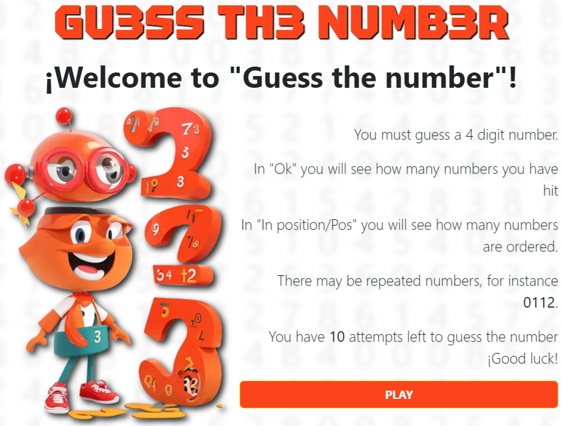
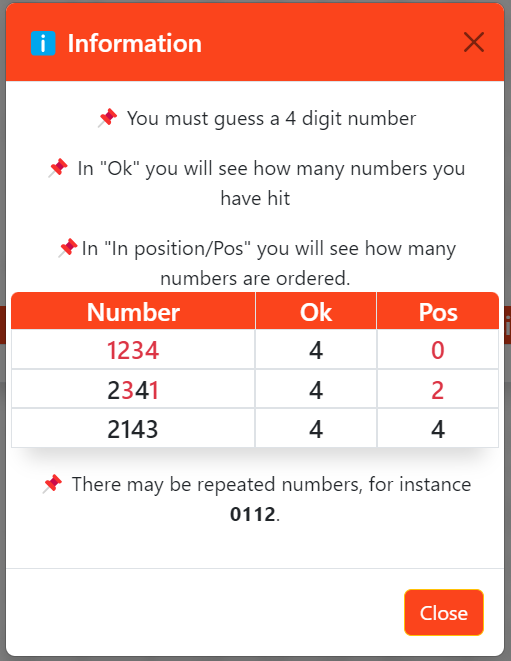
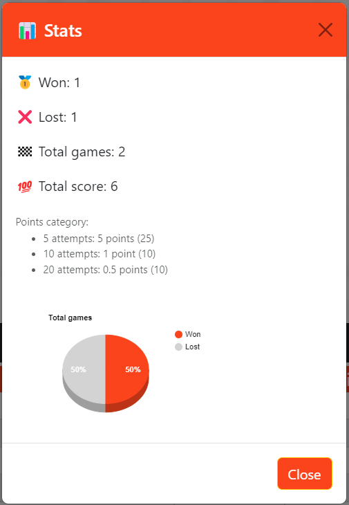
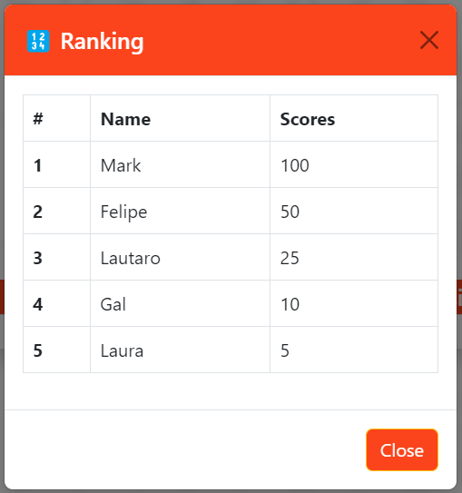
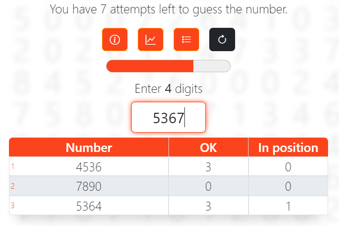
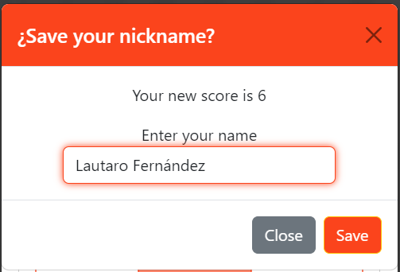
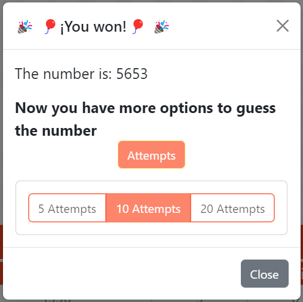
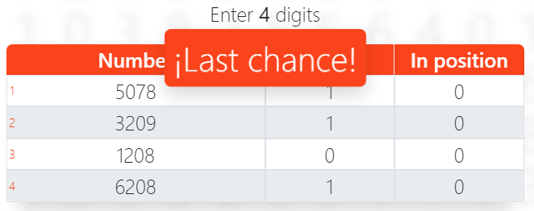
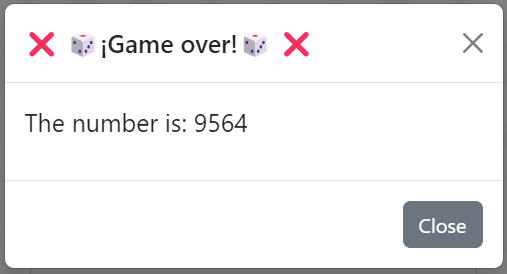
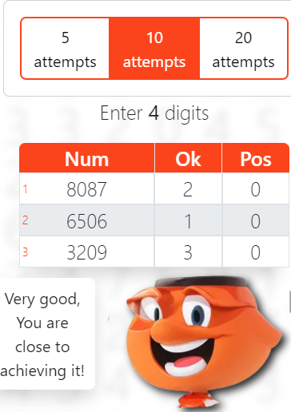

# Adivina el número

A simple game to use logic. You will have to guess a 4-digit number. There are 10,000 possible combinations and 10 attempts. The characters were created with AI tools.

## Mockup

## Screenshots

## Demo

## Color Reference

| Colors             | Hex                                                                |
| ----------------- | ------------------------------------------------------------------ |
| Main color |  #0a192f |
| Secondary color |  #f8f8f8 |
| Another color |  #00b48a |

## 🛠 Skills
Javascript, HTML, CSS, Bootstrap

## Roadmap

- Additional browser support

- Add more integrations

- OOP paradigm

## Next features

- Gift cards

## Authors

- [@lautarof25](https://www.github.com/lautarof25)

